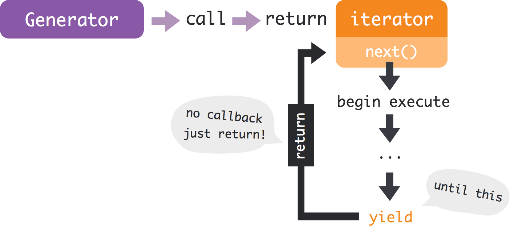

# Generator và xử lý asynchronous trong JavaScript

Mặc dù đã có rất nhiều bài viết trên mạng về Generator trong JavaScript ES6, nhưng mình quyết định viết thêm 1 bài nữa, hy vọng đây sẽ là bài cuối cùng về Generator mà các bạn cần tìm để đọc =))

## Vậy, Generator là gì?

Đầu tiên, chúng ta sẽ xem cách hoạt động của một hàm thông thường trong JavaScript:

```
function hello() {
    console.log('Hello World');
    return 100;
}
```

Khi thực thi hàm này, JavaScript sẽ chạy từ đầu đến cuối hàm, làm các việc như: In ra màn hình chữ `Hello World`, rồi return về con số `100`, xong, đến đây nhiệm vụ của nó hoàn thành.


Generator thì không chạy như thế. Nó là những hàm có khả năng chạy, return kết quả xong rồi dừng đó, khi nào thích thì có thể quay lại và xử lý tiếp rồi lại return tiếp. Nói tới đây làm mình tưởng tượng tới hình ảnh con bò ăn cỏ xong để dành lâu lâu lấy ra nhai lại =.= (ví dụ hơi thô bạo nhưng mà nó rất là tương đồng =)))


## Nói rõ chút coi?

Vầng, để em trình bày rõ hơn tí ạ...

Khi chúng ta gọi tới một hàm Generator, thì nội dung của hàm đó chưa được gọi ngay đâu, mà nó sẽ trả về một đối tượng gọi là `iterator` (cứ tạm gọi nó là con trỏ đi, về sau mình sẽ nói kĩ hơn).

Trong đối tượng `iterator` này có một hàm `next()`, khi chúng ta gọi đến hàm này thì phần nội dung của hàm mới bắt đầu được chạy, và nó sẽ dừng lại + trả về giá trị khi gặp câu lệnh `yield`.



Và chúng ta có thể truy cập tới dữ liệu trả về này qua hàm `next()` ở trên.

```
var result = hamGenerator.next();
// Ket qua la: result.value
```
