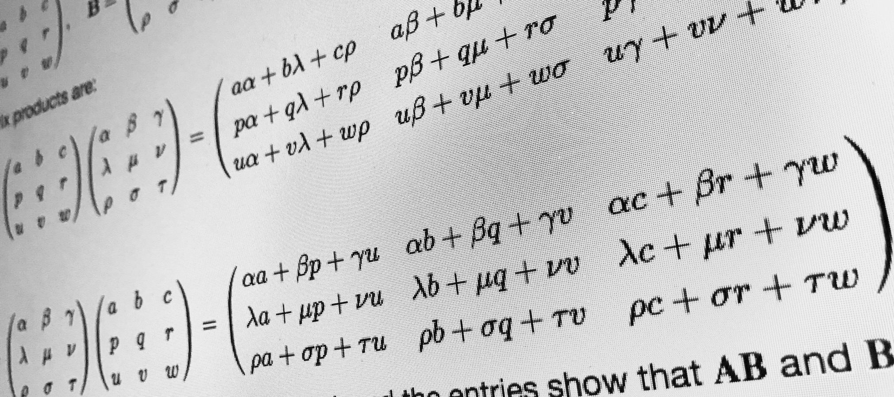

# Các thuật toán nhân ma trận

Ma trận và các phép toán liên quan tới nó là một phần rất quan trọng trong hầu hết mọi thuật toán liên quan đến số học. 

Ở [bài trước](https://huytd.github.io/posts/fibonacci-4m.html), chúng ta có đề cập tới việc ứng dụng phép nhân ma trận để tính số Fibonacci một cách hiệu quả. Vậy thuật toán nhân ma trận mà chúng ta sử dụng ở trong bài viết đã thực sự hiệu quả hay chưa?

<cover></cover>

Trong quá trình tìm hiểu để viết bài này thì mình phát hiện ra một điều khá là thú vị, đó là có rất nhiều thuật toán để thực hiện nhân ma trận, tuy nhiên ngành khoa học máy tính vẫn chưa tìm ra được câu trả lời cho câu hỏi: **Đâu là thuật toán tối ưu để thực hiện phép nhân ma trận?** [[1]](https://en.m.wikipedia.org/wiki/List_of_unsolved_problems_in_computer_science#Other_algorithmic_problems)

## Phương pháp toán học

Nhắc lại một chút kiến thức toán học về phương pháp nhân 2 ma trận $A$ và $B$, điều kiện đầu tiên để có thể thực hiện phép nhân này là **khi số cột của ma trận $A$ bằng số hàng của ma trận $B$**.

Với $A$ là một ma trận có kích thước `$m \times n$` và $B$ là một ma trận kích thước `$n \times p$` thì tích của $A \times B$ sẽ là một ma trận `$m \times p$` được tính bằng cách sau:

<math>
\left( \begin{array}{ccc}
a & b  \\
d & e  \end{array} \right) 
\times
\left( \begin{array}{ccc}
x \\
y
\end{array} \right)
=
\left( \begin{array}{ccc}
ax + cy \\
bx + dy
\end{array} \right)
</math>

Hình sau mô tả cách tính một phần tử `AB[i][j]` của ma trận tích:

Một phần tử là tổng của phép nhân các phần tử trong một hàng của ma trận $A$ với các phần tử trong cột tương ứng trong ma trận $B$

<math>
[AB]_{i,j} = A_{i,1}B_{1,j} + A_{i,2}B_{2,j} + \ldots + A_{i,n}B_{n,j}
</math>

Hay viết cho gọn hơn như sau:

<math>
[AB]_{i,j} = \displaystyle\sum_{r=1}^{n} A_{i,r}B_{r,j}
</math>

## Implement dùng vòng lặp

Chúng ta thường implement thuật toán nhân ma trận bằng cách áp dụng chính xác công thức trên, sử dụng vòng lặp, như sau:

**Input:** Hai ma trận A kích thước $m \times n$ và B kích thước $n \times p$

**1:** Khởi tạo ma trận C có kích thước $m \times p$  
**2:** For i từ $1 \rightarrow n$: 
**3:** &emsp;For j từ $1 \rightarrow p$: 
**4:** &emsp;&emsp;Gán $sum = 0$ 
**5:** &emsp;&emsp;For r từ $1 \rightarrow m$: 
**6:** &emsp;&emsp;&emsp;Gán `$sum = sum + A_{i,r} \times B_{r,j}$` 
**7:** &emsp;&emsp;Gán `$C_{i,j} = sum$` 

**Output:** Ma trận C kích thước $m \times p$

