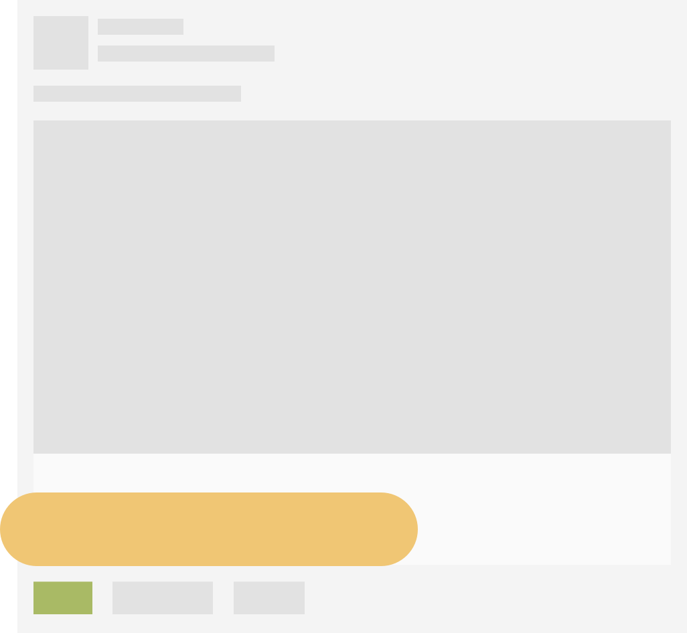
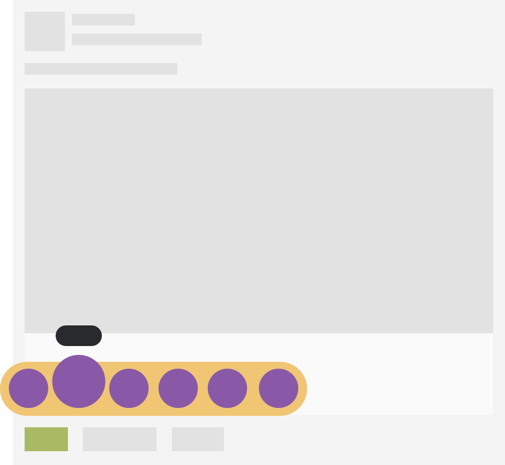
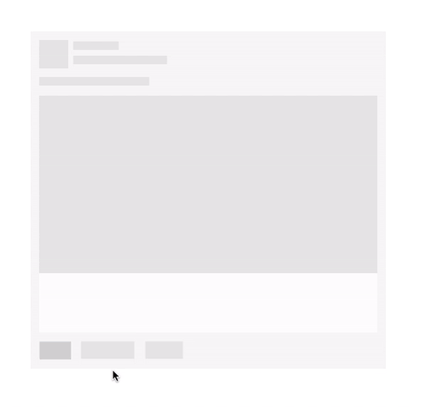

# Phức tạp hoá vấn đề: Phân tích và mô phỏng nút cảm xúc của Facebook - Phần 1


Tiếp tục sê-ri [Phức tạp hoá vấn đề](http://huytd.github.io/posts/phuc-tap-hoa-datepicker.html) lần này, chúng ta sẽ cùng tìm hiểu và mô phỏng lại một chức năng mà mọi người đang bắt đầu sử dụng hằng ngày, đó là chức năng thể hiện cảm xúc (reaction) của Facebook.


Khi bạn rê chuột vào nút **Like**, một khối màu trắng sẽ hiện ra, đồng thời các biểu tượng cảm xúc cũng bay lên, nhún nhún trông rất là bắt mắt, khi ta rê chuột vào từng biểu tượng nó sẽ to ra, sau đó ta chỉ cần click vào đó để thể hiện cảm xúc của mình.

## Phân tích hiệu ứng Reaction

Đầu tiên, để hiểu rõ hơn về hiệu ứng này, chúng ta cùng phân tích nó bằng cách chia nhỏ thành từng bước.

Đây là trạng thái đầu tiên của một bản tin trên Newsfeed mà chúng ta thường thấy:


Tiếp theo, khi chúng ta rê chuột vào nút **Like**, hộp Reactions sẽ hiện ra:



Liền sau đó là các biểu tượng cảm xúc xuất hiện, các biểu tượng cảm xúc này xuất hiện từ những vị trí khác nhau (về độ cao), và từ những thời điểm khác nhau (cách nhau vài mili-giây), tạo cảm giác rất mượt, mũi tên màu đỏ trong hình thể hiện lộ trình chuyển động của các biểu tượng cảm xúc:


Nếu đi sâu vào chi tiết của hiệu ứng này, chúng ta có thể thấy mỗi một biểu tượng cảm xúc, sẽ di chuyển với lộ trình như sau:


Đầu tiên chúng trong suốt (opacity thấp), và cách xa hộp Reaction, sau đó chuyển động tiến dần về hộp Reaction, tăng dần opacity, đến khi gặp hộp Reaction thì chúng còn chuyển động lên trên một khoảng nhỏ trước khi chạy ngược trở lại và đi về vị trí cần đến.

Sau khi hoàn thành hiệu ứng xuất hiện, các biểu tượng cảm xúc lúc này trải đều trên hộp Reactions như hình sau, và chờ sự tương tác từ phía người dùng:


Khi người dùng rê chuột vào từng biểu tượng cảm xúc, nó sẽ được phóng to lên đồng thời một label nhỏ có nền màu đen hiện ra trên đầu:



## Implement phần "thô"

Chúng ta sẽ implement lại hiệu ứng này bằng các kĩ thuật animation, transition, transform của CSS.

Đầu tiên, chúng ta sẽ xây dựng phần "thô" của hiệu ứng, tức là tạo ra các đối tượng trên màn hình, rê chuột vào nó ẩn hiện ẩn hiện, nhưng chưa có hiệu ứng chuyển động mượt mà gì cả. Phần mông má mượt mà đó sẽ dành cho phần sau.

Các bạn có thể vừa đọc vừa làm theo bằng cách tạo một pen mới trên [Codepen.io](http://codepen.io), hoặc viết code ngay trên máy tính của các bạn.

Lưu ý ở đây mình dùng [Sass](http://sass-lang.com/) để tiện hơn trong việc xử lý các đoạn tính toán dành cho animation. Nếu viết code trên máy tính, bạn cần cấu hình để chạy được Sass, còn không thì cứ dùng Codepen cho tiện.

### Trước khi bắt đầu
Trước khi đi vào implement phần chính (animation), chúng ta tạo ra một hộp tin trên newsfeed giống như hình bên dưới, khi rê chuột vào vùng có nút Like thì thì vùng này sẽ chuyển sang màu xanh.

Code HTML:

```
<div class="feed">
  <a class="like-btn">

  </a>
</div>
```

CSS (SCSS):

```
html, body {
  padding: 20px;
  font-family: sans-serif;
}

.feed {
  width: 500px; height: 473px;
  background-image: url(<đường-dẫn-tới-file-hình>);
  position: relative;

  .like-btn {
    width: 44px; height: 25px;
    background: #D0D0D0;
    position: absolute;
    bottom: 13px; left: 13px;
    cursor: pointer;

    &:hover {
      background: #718C00;
    }
  }
}
```

Đối với `<đường-dẫn-tới-file-hình>`, bạn có thể copy đường dẫn của file hình newsfeed ở đầu bài, hoặc dùng địa chỉ: [http://i.imgur.com/HckmGbj.png](http://i.imgur.com/HckmGbj.png)

Bắt đầu ra dáng Facebook thiệt rồi :v giờ chúng ta sẽ đi vào phần chính.

### Hiển thị hộp Reactions

Gọi là "hộp reactions" (reaction box) vì mình không biết phải dịch nó ra thế nào hết =)) đại khái đây là một khối hình chữ nhật màu trắng được bo tròn 2 bên dùng để hiển thị các biểu tượng cảm xúc.

Ban đầu thì reaction box sẽ không được hiển thị, cho đến khi bạn rê chuột vào nút Like.

Chúng ta thêm một thẻ `div` mới có class là `reaction-box` vào bên trong thẻ `a` của nút Like như sau:

Code HTML:

```
<div class="feed">
  <a class="like-btn">
    <div class="reaction-box">
    </div>
  </a>
</div>
```

Sau đó viết CSS cho class `reaction-box` ở bên trong class `like-btn`, lưu ý: ban đầu class này sẽ có thuộc tính `display: none;` để nó ẩn đi, và chúng ta chỉ set thuộc tính này thành `display: block;` khi ở bên trong sự kiện `:hover` của class `like-btn`.

CSS (SCSS):

```
.like-btn {
    ...

    .reaction-box {
      position: absolute;
      width: 312px; height: 55px;
      background: #F0C674;
      border-radius: 28px;
      left: -25px; bottom: 25px;
      display: none;
    }

    &:hover {
      ...

      .reaction-box {
        display: block;  
      }
    }
  }
```

Chúng ta có kết quả như hình bên dưới:


### Các biểu tượng cảm xúc

Giờ chúng ta thêm vào các biểu tượng cảm xúc (emo icon), mà thực ra trong bài này chỉ dùng các hình tròn màu tím, bé bé xinh xinh để mô phỏng thôi :v

Mỗi một emo icon sẽ có dạng như sau:

```
<div class="reaction-icon">
  <label>Like</label>
</div>
```

Là một thẻ `div`, bên trong chứa một `label` để làm nhãn tên cho nó, giống với trên Facebook.

Ta cần thêm vào 6 thẻ `div` như thế này, tượng trưng cho 6 cảm xúc: Like, Love, Haha, Wow, Sad và Angry vào bên trong `reaction-box`

Các thẻ `reaction-icon` này khi rê chuột vào sẽ có hiệu ứng phóng to ra, đối với hiệu ứng này, chúng ta sẽ dùng thuộc tính CSS tên là `transform: scale()` để thực hiện.

Code HTML:

```
...
<div class="reaction-box">
  <div class="reaction-icon">
    <label>Like</label>
  </div>
  <div class="reaction-icon">
    <label>Love</label>
  </div>
  <div class="reaction-icon">
    <label>Haha</label>
  </div>
  <div class="reaction-icon">
    <label>Wow</label>
  </div>
  <div class="reaction-icon">
    <label>Sad</label>
  </div>
  <div class="reaction-icon">
    <label>Angry</label>
  </div>
</div>
...
```

Chèn đoạn CSS sau vào bên trong đoạn CSS của class `reaction-box`:

CSS (SCSS):

```
.reaction-box {
  ...
  // Chèn đoạn bên dưới này nhé
  .reaction-icon {
    width: 40px; height: 40px;
    display: inline-block;
    background: #8959A8;
    border-radius: 20px;
    margin: 8px -1px 0 8px;
    text-align: center;

    label {
      padding: 3px 5px 3px 5px;
      position: relative;
      top: -24px;
      border-radius: 10px;
      font-size: 11px;
      color: #FFF;
      background: #333;
    }
  }
}
```

Đồng thời, chèn thêm đoạn CSS dưới đây vào đoạn sự kiện `:hover` của `like-btn`:

```
&:hover {
  ...

  .reaction-box {
    ...

    // Thêm đoạn này nữa
    .reaction-icon:hover {
      transform: scale(1.4);
      transform-origin: bottom;
    }
  }
}
```

Ở sự kiện `:hover` của `reaction-icon`, chúng ta dùng thuộc tính `transform: scale(1.4)` để phóng to emo icon này lên `1.4` lần, đồng thời dùng thuộc tính `transform-origin: bottom` để xác định tâm của emo icon là ở cạnh bên dưới của nó. Bạn có thể thử bỏ hoặc thay đổi thuộc tính `transform-origin` để xem cách nó phóng to như thế nào khi không gán về `bottom`.

Ta có kết quả như hình sau:



### Vùng hover chuột của nút like

Nếu để ý, các bạn sẽ thấy hộp `reaction-box` của chúng ta nằm quá sát so với nút Like. Thử dịch chuyển nó lên một tí xem?

Thay đổi thuộc tính `bottom` của class `reaction-box` lên `10px`, từ `25px` thành `35px`.

```
.reaction-box {
    ...
    left: -25px; bottom: 35px;
    ...
```

Nhìn có vẻ ổn hơn rồi, nhưng mà cái quái gì đây? Không rê chuột lên reaction box được nữa :(( Sao ông phá code của tui vậy, ông thần trời đánh kia???


Thực ra nguyên nhân là do khoảng cách của hộp reaction box đang cách nút like của chúng ta một khoảng `10px`, nên khi chúng ta vừa định rê chuột lên reaction box thì vô tình rớt ra khỏi phạm vi rê chuột của nút Like, dẫn đến sự kiện `:hover` của nút Like bị mất. Nếu xem trong file CSS thì các bạn sẽ thấy, chúng ta hiển thị reaction box thông qua sự kiện `:hover` của nút Like.

Vậy cách xử lý ở đây là làm cho nút Like to ra để con trỏ chuột vẫn nằm bên trong nó trong đoạn đường đi lên reaction box.

Có rất nhiều cách để làm điều này, mình sẽ giới thiệu một cách đơn giản nhất, đó là sử dụng pseudo element `::before`. Khi ta sử dụng `::before`, trình duyệt sẽ chèn một đoạn nội dung vào đầu của thẻ mang `::before`. Ở đây chúng ta sẽ chèn vào một đoạn nội dung trong suốt, user không nhìn thấy được, có kích thước `44x10`, lấp vào khoảng trống giữa nút Like và reaction box.

```
.like-btn {
  ...
  &::before {
    content: "."; opacity: 0;
    display: block;
    width: 44px; height: 10px;
    position: absolute;
    top: -10px; left: 0;
  }
```

Giờ bạn có thể lưu lại và test thử, giờ nó đã đẹp và chuẩn trở lại rồi :v

### Chỉ hiển thị nhãn tên của emo icon khi rê chuột vào

Giờ chúng ta sẽ ẩn hết các nhãn tên của emo icon đi, và chỉ hiển thị nó lên khi rê chuột vào.

Thêm vào thuộc tính `visibility: hidden;` cho thẻ `label`

CSS (SCSS):

```
label {
  ...
  visibility: hidden;
}
```

Và trong sự kiện `:hover` của class `reaction-icon`, chúng ta thêm vào định nghĩa CSS cho thẻ label, gán cho nó thuộc tính `visibility: visible;` để hiện nó trở lại:

```
.reaction-icon:hover {
   ...
   label {
      visibility: visible;
   }
}
```

Giờ refresh lại page để xem lại thành quả nào:


Sau đây là đoạn code đầy đủ cho giai đoạn này:

Code HTML:

```
<div class="feed">
  <a class="like-btn">
    <div class="reaction-box">
      <div class="reaction-icon">
        <label>Like</label>
      </div>
      <div class="reaction-icon">
        <label>Love</label>
      </div>
      <div class="reaction-icon">
        <label>Haha</label>
      </div>
      <div class="reaction-icon">
        <label>Wow</label>
      </div>
      <div class="reaction-icon">
        <label>Sad</label>
      </div>
      <div class="reaction-icon">
        <label>Angry</label>
      </div>
    </div>
  </a>
</div>
```

CSS (SCSS):

```
html, body {
  padding: 20px;
  font-family: sans-serif;
}

.feed {
  width: 500px; height: 473px;
  background-image: url(http://i.imgur.com/HckmGbj.png);
  position: relative;

  .like-btn {
    width: 44px; height: 25px;
    background: #D0D0D0;
    position: absolute;
    bottom: 13px; left: 13px;
    cursor: pointer;

    &::before {
      content: "."; opacity: 0;
      display: block;
      width: 44px; height: 10px;
      position: absolute;
      top: -10px; left: 0;
    }

    .reaction-box {
      position: absolute;
      width: 312px; height: 55px;
      background: #F0C674;
      border-radius: 28px;
      left: -25px; bottom: 35px;
      display: none;

      .reaction-icon {
        width: 40px; height: 40px;
        display: inline-block;
        background: #8959A8;
        border-radius: 20px;
        margin: 8px -1px 0 8px;
        text-align: center;

        label {
          padding: 3px 5px 3px 5px;
          position: relative;
          top: -24px;
          border-radius: 10px;
          font-size: 11px;
          color: #FFF;
          background: #333;
          visibility: hidden;
        }
      }
    }

    &:hover {
      background: #718C00;

      .reaction-box {
        display: block;  

        .reaction-icon:hover {
          transform: scale(1.4);
          transform-origin: bottom;

          label {
            visibility: visible;
          }
        }
      }
    }
  }
}
```

Phần 1 đến đây là kết thúc. Chúng ta tạm thời nghỉ tay ở đây. Code nhiều quá là không tốt. Nhớ nhé, không hề tốt.

Hẹn gặp lại các bạn trong phần 2, chúng ta sẽ đi vào phần mông má :v implement các hiệu ứng chuyển động để làm cho reaction box của chúng ta mượt mà hơn.
