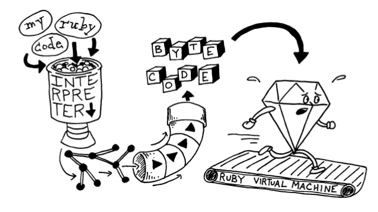

# Giới thiệu về Rust

[Rust](https://rust-lang.vn/) (đọc là **rớt-xtờ** /rʌst/) là một ngôn ngữ lập trình hệ thống (system programming language) được quảng bá là có tốc độ cực kì nhanh, ngăn chặn được phần lớn mọi bug crash ([segfaults](https://en.m.wikipedia.org/wiki/Segmentation_fault)), ngăn chặn được [data race](http://docs.oracle.com/cd/E19205-01/820-0619/geojs/index.html), rất memory safe mà lại không cần tới garbage collector!

Cú pháp cơ bản của một chương trình `Hello World` trong Rust như thế này:

```
fn main() {
  println!("hello, {}", "world");
}
```

Bạn thấy gì qua đoạn chương trình trên nào? Có vẻ vừa giống C, vừa giống Go hay Swift, Java, C#,... mỗi thứ một tí, đúng không? 

## Tại sao nên dùng Rust?

Chắc các bạn cũng biết đến khả năng kiểm soát tài nguyên khi làm việc với các ngôn ngữ như C/C++ hay Java, Python, Ruby, JavaScript,...


Với C/C++, bạn được: 
- Toàn quyền kiểm soát mọi thứ (`malloc`, `free`,...)
- Thường xuyên đau đầu với `memory leak`, `data race`, `segfaults`,... 

Đối với thiên đường JavaScript hay Ruby, bạn:
- Chẳng cần phải quan tâm một biến được cấp phát như thế nào và mất đi ra sao
- Nhưng trade-off của nó chính là performance cực kì tệ hại.

Rust là giải pháp kết hợp cho ưu điểm của cả 2 loại ngôn ngữ trên, khi làm việc với Rust, bạn không cần phải quan tâm tới việc bị `memory leak` hay `segfault`, khi làm multi thread, bạn không còn sợ `data race` vì `rust compiler` đã lo hết chuyện đó cho bạn, để đảm bảo trong lúc chạy (runtime) thì chương trình sẽ luôn hoạt động một cách an toàn và vẫn đảm bảo được tốc độ và performance tối ưu nhất.

À! Chắc sẽ có bạn hỏi: **Rust và Go thì nên chọn ai?** Nếu có cùng thắc mắc, thì [xin mời bạn xem bài này nhé](https://dave.cheney.net/2015/07/02/why-go-and-rust-are-not-competitors)

## Rust nhanh tới mức nào?

OK. Đầu tiên phải nói ngay là Rust không phải ngôn ngữ lập trình nhanh nhất, không có cái nào như thế cả.

Cũng giống như C hay Go (và khác với Ruby, NodeJS hay Python,...), một chương trình Rust sẽ được compile trực tiếp ra file binary để chạy.


<center style="font-size: 0.7em;">Ảnh lấy từ: [http://www.slideshare.net/LizBaillie/rustconf-2016-illustrated-adventure-guide-65894363](http://www.slideshare.net/LizBaillie/rustconf-2016-illustrated-adventure-guide-65894363)</center>

Ưu điểm của việc này đó là tốc độ thực thi nhanh chóng, vì được thực thi trực tiếp bởi máy tính chứ không phải trình thông dịch (interpreter) hay JIT (Just-In-Time) execution (như Java hay C#).

Khi so sánh với các ngôn ngữ khác, thực sự thì đây là một việc không cần thiết, nhưng chúng ta có thể tham khảo, bảng so sánh tốc độ thực thi [tính tổng dãy số Fibonacci](https://huytd.github.io/posts/fibonacci-4m.html) giữa các ngôn ngữ Rust, Go, NodeJS và Swift:


Bạn có thể xem bảng so sánh performance của Rust và một số ngôn ngữ khác tại:

- [The Computer Language Benchmarks Game](http://benchmarksgame.alioth.debian.org/u64q/compare.php?lang=rust&lang2=java)
- [Go vs Node vs Rust vs Swift](https://grigio.org/go-vs-node-vs-rust-vs-swift/)

## Rust an toàn tới cỡ nào?

Một trong những điểm mà Rust quảng cáo đó là an toàn, không bao giờ bị crash, vậy làm sao Rust đạt được những điều đó?

Câu trả lời nằm ở **Rust Compiler**.

Thông thường, phần lớn lỗi của một chương trình C/C++ sẽ liên quan đến việc truy xuất bộ nhớ khi thực thi (runtime error - ví dụ bạn truy cập vào vùng bộ nhớ đã bị giải phóng, sử dụng nhầm các biến có giá trị null, lỡ tay tạo ra nhiều thread cùng ghi vào một vùng nhớ,...)


Để ngăn chặn vấn đề này, Rust Compiler đề ra một loạt các quy tắc để kiểm tra ngay khi nó biên dịch chương trình, chúng ta sẽ không đi sâu vào các quy tắc này, nhưng mình sẽ nói sơ qua:

- Mọi biến mặc định đều là immutable, và không được mang giá trị null (nên không có lỗi `NullReferenceException`)
- Trong Rust, một vùng nhớ luôn có **một** biến **sỡ hữu** nó.
- Gán một biến vào một biến khác, tức là bạn chuyển **quyền sở hữu** vùng nhớ của biến đó cho biến mới. Biến cũ không được quyền truy xuất tới đó nữa.
- **Nhiều** biến khác có thể **mượn** vùng nhớ đó **chỉ để đọc** (read only).
- Nhưng **chỉ có một** biến có quyền **mượn** để **ghi** giá trị lên đó.
- Một biến chỉ có thể tồn tại bên trong scope của nó, ra khỏi scope đó nó sẽ bị giải phóng **ngay lập tức**.

Bất cứ khi nào lập trình viên vi phạm các quy tắc này, Rust sẽ báo cho bạn biết ngay khi biên dịch, chứ không để lọt lỗi.

Trong số các quy tắc được liệt kê ở trên, 5 quy tắc cuối cùng chính là [Ownership, Borrowing & Lifetime System](https://doc.rust-lang.org/book/ownership.html) của Rust.

Ví dụ với đoạn code sau minh họa cho vấn đề **chuyển quyền sở hữu** đề cập ở trên:

```
let v = vec![1, 2, 3];
let v2 = v;

println!("v[0] is: {}", v[0]);
```

Theo lẽ thường, chúng ta nghĩ đoạn code trên sẽ in ra số `1`, là giá trị của `v[0]`. Nhưng khi biên dịch thì sẽ gặp ngay lỗi:

```
error: use of moved value: `v`
println!("v[0] is: {}", v[0]);
```

Đừng lo nếu bạn không hiểu tại sao lại phát sinh ra lỗi này, ví dụ này chỉ để minh họa cho bạn thấy về khả năng bắt lỗi runtime ngay cả trong compile time của Rust thôi.

## Rust không cần Garbage Collector?

Đúng vậy, Rust không có **garbage collector** (GC), nhưng vẫn đảm bảo được tính an toàn về bộ nhớ, đây là một trong những chức năng đặc biệt của Rust.


Thay vào đó, Rust Compiler sẽ dự đoán được khi nào một biến sẽ hết được sử dụng và tự động chèn thêm code logic để giải phóng nó, giảm thiểu chi phí cho việc quản lý bộ nhớ lúc runtime. 

```
fn main() {
    let score = 10; // Khởi tạo vùng nhớ mới, cấp phát cho biến score
    // Tới đây là hết scope của biến score, mình nên giải phóng nó đi thôi 
}
```

Đoạn trên là diễn biến suy nghĩ của Rust Compiler qua từng dòng code :))

Và việc này được kiểm soát thông qua Ownership System.

Việc không có GC còn giúp Rust có thể dễ dàng được [nhúng](http://calculist.org/blog/2015/12/23/neon-node-rust/) vào các ngôn ngữ có GC khác nữa.

## Dùng Rust có thể làm được gì?

Đây là câu hỏi mà mình thấy nhiều người hỏi nhất. 

Câu trả lời là: **Mọi thứ!**

Mặc dù là một ngôn ngữ lập trình hệ thống (system programming language), nhưng Rust nhắm tới việc cạnh tranh với C/C++ để tăng độ an toàn và cải thiện performance cho các phần mềm được viết ra, vì thế Rust có thể làm được mọi thứ mà C/C++ làm được, ví dụ:

- [Viết hệ điều hành](http://os.phil-opp.com/)
- [Lập trình web](https://github.com/kud1ing/awesome-rust#web-programming)
- [Phát triển mobile app](https://github.com/kud1ing/awesome-rust#mobile)
- [Viết Terminal Emulator](https://github.com/jwilm/alacritty)
- [Machine Learning](https://github.com/kud1ing/awesome-rust#machine-learning)
- [Viết Database](https://github.com/kud1ing/awesome-rust#database)
- [Viết DNS server](https://github.com/bluejekyll/trust-dns)
- [Viết browser engine](https://github.com/servo/servo)
- [Viết Giả lập Playstation/NES/Gameboy/...](https://github.com/kud1ing/awesome-rust#applications-written-in-rust)
- [Viết Game](https://github.com/kud1ing/awesome-rust#applications-written-in-rust)
- [Xử lý ảnh](https://github.com/kud1ing/awesome-rust#image-processing)
- [Lập trình mạng](https://github.com/kud1ing/awesome-rust#network-programming)
- ...

## Giờ bắt đầu học Rust như thế nào?


Để bắt đầu, các bạn có thể tham khảo một số tài liệu sau:

- [Rust by Example](http://rustbyexample.com/): Trang web tổng hợp đầy đủ các ví dụ từ đơn giản đến phức tạp để giúp bạn làm quen với cú pháp và các kĩ thuật trong Rust.
- [Sách The Rust Programming Language](https://doc.rust-lang.org/book/): Đây là cuốn sách chính thức của Rust, trình bày một cách đầy đủ và chi tiết từ A-Z khi học Rust.
- [Slide Rust's Ownership and Move Semantics](http://www.slideshare.net/saneyuki/rusts-ownership-and-move-semantics): Một slide khá chi tiết trình bày về Ownership System của Rust. 

Ngoài ra, các bạn có thể tham gia vào các cộng đồng Rust như:

- [Diễn đàn](https://users.rust-lang.org/): Diễn đàn chính thức của Rust
- [IRC](https://chat.mibbit.com/?server=irc.mozilla.org&channel=%23rust-beginners): Kênh IRC để hỏi các vấn đề khi học Rust
- [Bản tin This Week in Rust](https://this-week-in-rust.org/): Nơi cập nhật tin tức hàng tuần về Rust, những thư viện mới, những sự kiện sắp diễn ra,...
- [Rust Blog](http://blog.rust-lang.org/): Nơi core team của Rust đưa ra các thông báo mới nhất về ngôn ngữ này.
- [Reddit](https://www.reddit.com/r/rust): Subreddit về Rust

For fun, bạn nên biết một số từ vựng nên biết trước khi gia nhập cộng đồng này :))

- **Rustacean**: Là từ chỉ những người sử dụng Rust, giống như **Gophers** hay **Rubyist** hay **Alchemist** (của Elixir).
- **Rustlandia**: Là khu vực mà các rustaceans hoạt động, cái này chắc chỉ có hội Rust mới có :))

Ngoài ra chúng ta cũng có cộng đồng **Rust Việt Nam**:

- [Trang web](https://rust-lang.vn)
- [Facebook Page](https://www.facebook.com/vietnam.rust/)
- [GitHub](https://github.com/rust-vietnam/)
- [Slack Chat](http://chat.ruby.org.vn/): Join vào channel [#rustlang](https://vietnamrb.slack.com/messages/rustlang/)

Hẹn gặp lại các bạn ở Rustlandia!!!
